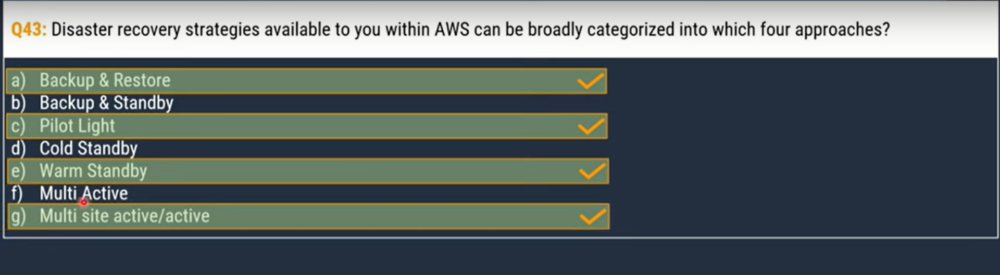

AWS  Cloud Practitioner Certification Notes
---------------------------------------------

### AWS Account creation

* AWS offers three types of account creation
    * Free trials
    * 12 months free
    * Always free

### Cloud Deployment Models

* AWS offers three cloud deployment models
    * `Cloud` deployment model / `Public` deployment model
    * `On-premises` deployment model / `Private` cloud deployment model
    * `Hybrid` cloud deployment model

### The 6 Pillars of the AWS Well-Architected Framework

[Refer here for explanation](https://aws.amazon.com/blogs/apn/the-6-pillars-of-the-aws-well-architected-framework/)  `MUST READ`

1. Operational Excellence pillar
2. Security pillar
3. Reliability pillar
4. Performance Efficiency pillar
5. Cost Optimization pillar
6. Sustainability pillar

### AWS EC2 instance types

[Refer here for full explanation](https://aws.amazon.com/ec2/instance-types/) `MUST READ`

* General Purpose
    * Balances compute, memory and networking resources 
* Memory Optimized
    * High performance databases
* Storage Optimized
    * Data warehousing applications
* Compute Optimized
    * High performance processors
* Accelerated Computing
    * Calculations that include floating-point number calculations, graphic processing and data pattern matching etc...
* HPC (High Performance Computing) Optimized 
    * Compute-intensive HPC workloads such as Computational Fluid Dynamics (CFD), Weather forcasting and molecular dynamics etc... 

### AWS Global Infrastructure

* [Refer here for AWS Global Infrastructure](https://aws.amazon.com/about-aws/global-infrastructure/)   `MUST READ`
* [Regions and Zones](https://docs.aws.amazon.com/AWSEC2/latest/UserGuide/using-regions-availability-zones.html)
    * Regions
    * Availability zones
    * Local zones
    * Wavelength zones
    * AWS Outposts

### AWS Backup and Disaster Recovery

[Refer here for complete explanation](https://docs.aws.amazon.com/whitepapers/latest/disaster-recovery-workloads-on-aws/disaster-recovery-options-in-the-cloud.html)

